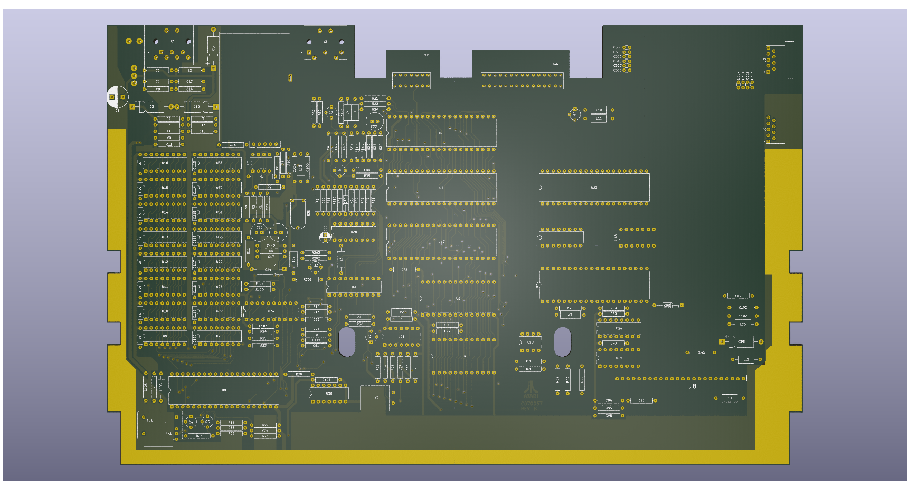

# Atari 65/130XE Reproduction

## Introduction

This project reproduces the PCB used in the Atari 65XE and 130XE.
There are several variations on the board, this targets the
earlier design that used 8 or 16 4164 DRAM chips. These boards are
marked as C070065 or C070067

The initial primary goal is to support diagnostics rather than
create replacement boards but this will likely become possible as 
the project progresses.

### Sources

The schematics that the design is taken from are themselves copies
of the original work.

The primary source of information is taken from an updated version
of the Atari workshop manual updated and reproduced by JER/Eightbitter.
A second source comes from earlier reproduction drawings by Jerzy Sobola.

## Interactive Bill of Materials

The initial output of the project will be a web based interactive bill
of materials that includes trace routing. This allows visual 
identification of individual traces on the board and the devices each
trace connects to.

## Engineering Files

Once the accuracy of the reproduction is verified the project output
will include gerber files to facilitate the fabrication of boards.

### Accuracy

While every effort is made to ensure that the board design is accurate
and faithful to the original, there will be variations in tolerances that
result in the need for fettling of the board to correctly fit the
original case.

The board design provided will be a direct copy in terms of the components
used and as such will require original parts, some of which are
effectively unobtainable other than from donor machines

## Progress

Transcription of the schematics is completed subject to review. Some minor
component numbering errors are present on the soure schematic and there are 
two gaps that likely should be components. The gaps will be resolved as the
PCB routing is performed.

Recreation of the original PCB routing is in progress and approximately 20%
complete.

Mounting holes for the board and shielding are not included yet. The PCB
outline is correct except for the cartridge/expansion port. Footprints for 
SIO port, power port and RF modulator are not included.

The footprint for the monitor port is correct for electrical connections 
but does not match the original mounting pins.

