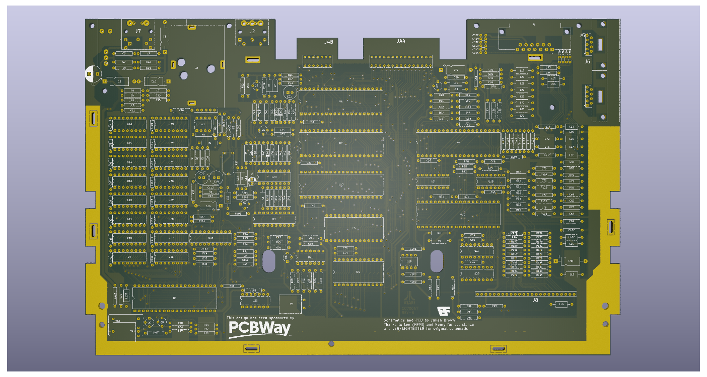

# Atari 65/130XE Reproduction

## Introduction

This project reproduces the PCB used in the Atari 65XE and 130XE.
There are several variations on the board, this targets the
earlier design that used 8 or 16 4164 DRAM chips. These boards are
marked as C070065 or C070067

The initial primary goal is to support diagnostics rather than
create replacement boards but this will likely become possible as 
the project progresses.

### Sources

The schematics that the design is taken from are themselves copies
of the original work.

The primary source of information is taken from an updated version
of the Atari workshop manual updated and reproduced by JER/Eightbitter.
A second source comes from earlier reproduction drawings by Jerzy Sobola.

## Interactive Bill of Materials

The initial output of the project will be a web based interactive bill
of materials that includes trace routing. This allows visual 
identification of individual traces on the board and the devices each
trace connects to.

## Engineering Files

Once the accuracy of the reproduction is verified the project output
will include gerber files to facilitate the fabrication of boards.

### Accuracy

While every effort is made to ensure that the board design is accurate
and faithful to the original, there will be variations in tolerances that
result in the need for fettling of the board to correctly fit the
original case.

The board design provided will be a direct copy in terms of the components
used and as such will require original parts, some of which are
effectively unobtainable other than from donor machines - notably the SIO
port, expansion port and half of the custom chips. 

The SALLY CPU chip can be replaced with an adapted 65C02 to add the missing
HALT signal. FREDDIE and POKEY are available as reproductions. The PIA can 
be replaced with a MC68B21 (or equivalent).

## Progress

Transcription of the schematics is completed subject to review. Some minor
component numbering errors are present on the soure schematic but are dealt
with as they are found. Some components on the schematic have been deleted
on the sample PCBs, these are removed when identified but left unattached
in the schematic for reference.

Recreation of the original PCB routing is in progress and approximately 50%
complete. All components are placed.

Mounting holes for the board and shielding are not included yet. The PCB
outline is correct.

Footprints for SIO, and the two joysticks need refiniement - the footprints
for both are non-standard so the current footprints should be considered as
placeholders only. The edge connectors require further detail to ensure
dimensional accuracy and relative positioning, and to include mounting/locating
holes.

## References

FREDDIE replacement - design by Candle'O'Sin. Sold by Retro Lemon in two 
flavours:  
* https://retrolemon.co.uk/atari-8bit-upgrades/182-freddie-cpld.html
* https://retrolemon.co.uk/atari-8bit-upgrades/81-freddie-module.html
  (only for use with matching SRAM module)

SALLY conversion - open source project you can fabricate (or have fabricated 
for you)
* https://github.com/TheByteAttic/Sally-to-W65C02S-adapter
* https://www.pcbway.com/project/shareproject/6502__W65C02S__to_Atari_SALLY_adapter_Board.html

POKEY replacement (and upgrade) - design by Retronics. Sold by Retro Lemon:
* https://retrolemon.co.uk/atari-8bit-upgrades/148-pokeymax.html
